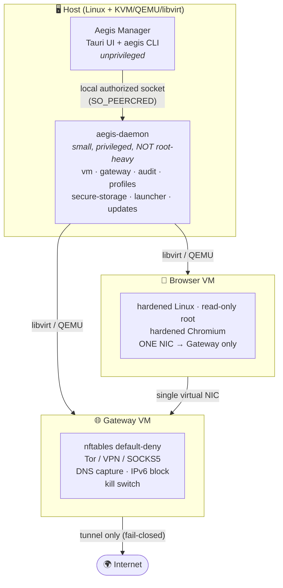

<div align="center">

# 🛡️ Aegis Private Browser

**Disposable, isolated browsing environments with a Whonix-style network split — built for _unlinkability to your real computer_, not empty "100% anonymous" promises.**

[](LICENSE)
[](rust-toolchain.toml)
[-6E56CF.svg?logo=linux&logoColor=white)](docs/architecture.md)
[](https://github.com/3godzinyL/Aegis-Private-Browser/actions/workflows/ci.yml)
[](Cargo.toml)
[](#-contributing)

<br/>

<!--
SCREENSHOT GALLERY
When the direct Discord image URLs are available, replace the text inside each
cell with the matching  tag shown in the cell's HTML comment. GitHub will
render a direct image URL in README. Keep the descriptive alt text.
-->
<table>
  <tr>
    <td width="50%" align="center">
      <strong>Screenshot 1 — main dashboard</strong><br/>
      <sub>Paste the direct Discord image URL here.</sub>
      <!--  -->
    </td>
    <td width="50%" align="center">
      <strong>Screenshot 2 — new private session</strong><br/>
      <sub>Paste the direct Discord image URL here.</sub>
      <!--  -->
    </td>
  </tr>
  <tr>
    <td width="50%" align="center">
      <strong>Screenshot 3 — runtime diagnostics</strong><br/>
      <sub>Paste the direct Discord image URL here.</sub>
      <!--  -->
    </td>
    <td width="50%" align="center">
      <strong>Screenshot 4 — what websites can see</strong><br/>
      <sub>Paste the direct Discord image URL here.</sub>
      <!--  -->
    </td>
  </tr>
</table>

<sub>To publish a screenshot, paste its direct Discord media URL into the matching `src="..."` and remove only that line's `<!--` / `-->`. GitHub will display it in this gallery.</sub>

</div>

---

## What Aegis actually gives you

Aegis manages **disposable or persistent browser environments**. Each full-VM private session runs
in its **own virtual machine** and can reach the Internet **only** through a separate, **fail-closed**
network gateway. If the tunnel drops, the kill switch cuts the browser off — it never silently falls
back to a direct connection.

The honest, measurable property is **unlinkability to the host**:

> A website may still observe that *"this browsing environment has some fingerprint."*
> It should **not** be able to tie that environment to your real computer, your everyday Chrome
> profile, your real IP, your physical GPU, or your host devices.

Aegis does **not** promise "100% anonymity," it does **not** try to defeat anti-fraud systems, and it
**cannot** protect you once you log into your own accounts or type in identifying data. Read the
honest boundaries in **[`docs/limitations.md`](docs/limitations.md)** before you rely on it.

---

## ✨ Features

- 🧱 **VM isolation** — the site runs in a Browser VM with no host GPU, camera, mic, USB, clipboard, or shared folders, and no knowledge of the host's physical NIC.
- 🌐 **Fail-closed networking** — one route out (Tor / VPN / SOCKS5 / HTTP) through a Gateway VM; `nftables` default-deny; DNS captured; IPv6 blocked; kill switch on any tunnel loss.
- 💨 **Disposable profiles** — an ephemeral session uses a throwaway overlay that is destroyed at close. The UI reports teardown/storage evidence honestly instead of assuming that disposal succeeded.
- 🎭 **Fingerprint normalization, not spoofing** — values are normalized to a shared baseline and kept stable within a session, aiming for a large uniform anonymity set instead of a unique fake device.
- 🔐 **Persistent-profile encryption status** — cryptographic sealing is available, while the UI keeps volume encryption `unknown` until a live encrypted-volume attestation is available.
- 🧩 **Unweakened engine** — Chromium sandbox and Site Isolation stay **on**; the real engine version stays in the User-Agent. We never ship `--no-sandbox` or `--disable-web-security`.
- ✅ **Six-check preflight gate** — the first tab never loads unless gateway, tunnel, DNS route, public IP, WebRTC policy, and IPv6 policy all pass.
- 🔏 **Signed images & updates** — ed25519-signed manifests, SHA-256 per artifact, downgrade protection, automatic rollback, SBOM.
- 🖥️ **Two front-ends** — a Tauri desktop UI and an `aegis` CLI over a small, authorized local socket to a privileged (but not root-heavy) daemon.
- 🧪 **Evidence-aware diagnostics** — the UI separates `configured`, `measured`, `verified`, and `unknown`; a written policy alone never becomes a green runtime claim.

---

## 🚦 Two ways to run

Aegis supports two postures. The **secure default** is full VM isolation; the host-browser mode is an
honest, clearly-labelled **reduced-protection** escape hatch for machines without a hypervisor.

| | 🏰 **Full VM isolation** _(default, `Enforcement::secure`)_ | 🪟 **Host-browser mode** _(reduced, `Enforcement::host_browser`)_ |
|---|---|---|
| **How it works** | Gateway VM + Browser VM (Whonix-style split) | Browser runs as a **host process**, routed through Tor/proxy on the host |
| **Host device isolation** | ✅ Full — no GPU/cam/mic/USB/clipboard/shared folders | ⚠️ None — the site executes on your real OS |
| **Network containment** | ✅ Gateway VM, `nftables` default-deny, kill switch | ⚠️ Host-side proxy/Tor only (`AEGIS_HOST_PROXY`) |
| **Fingerprint normalization** | ✅ Balanced / Strict | ➖ Reduced (host OS characteristics leak more) |
| **Requires** | Linux + KVM/QEMU/libvirt | Any host with a working proxy/Tor |
| **Isolation level reported** | `full VM isolation` | `host process (reduced)` |
| **Use it for** | The real thing | Trying Aegis / hosts without KVM (Windows dev target) |

> [!IMPORTANT]
> Host-browser mode does **not** provide VM isolation. The UI and CLI label it as *reduced protection*
> and never claim full anonymity in that mode. It needs Tor or a proxy — a VPN is only supported in full-VM mode
> (the Gateway VM routes it). Full setup is in **[`docs/INSTALL-linux.md`](docs/INSTALL-linux.md)**.

---

## 🗺️ Architecture



```
Web content ─► Browser VM ─► (one NIC) ─► Gateway VM ─► tunnel ─► Internet
                   ▲                          │
                   └──── never a direct path ─┘   (on any break the kill switch
                                                    engages — never a direct
                                                    connection)
```

The three structural guarantees: the Browser VM does **not** know the host's physical NIC, does **not**
know the host's real public IP, and has **no** alternative network route. Everything else exists to keep
those true even when something fails. Full detail: **[`docs/architecture.md`](docs/architecture.md)**.

---

## 🔄 How a private session works

1. **Provision** — clone the clean, read-only base snapshot onto a fresh disposable qcow2 overlay; allocate a random encryption key **in RAM**.
2. **Start the gateway** — boot the Gateway VM; establish the tunnel (Tor / VPN / SOCKS5 / HTTP).
3. **Preflight (the gate)** — run the **six** checks: `gateway_ready`, `tunnel_ready`, `dns_route_verified`, `public_ip_observed`, `webrtc_policy_loaded`, `ipv6_policy_verified`. **No partial pass.**
4. **Browse** — only if all six pass (`ProtectionStatus::Active`) is the browser process launched. `Browsing` is entered only after a liveness check confirms that process.
5. **Watch** — diagnostics show isolation, engine, cohort, gateway/tunnel/DNS/IPv6/WebRTC, kill-switch and website-visible values. Every value is marked `configured`, `measured`, `verified`, or `unknown`.
6. **Close & destroy** — terminate processes, wipe the RAM key, and request overlay destruction. Cleanup remains visible as unknown unless the runtime returns proof of teardown.

If anything on the containment or isolation path fails at any point, the error is classified and the
**kill switch engages before the error is even surfaced** (fail-closed).

---

## 🚀 Quickstart

> First-class platform is **Linux + KVM/QEMU/libvirt**. The host-side Rust workspace is cross-platform and
> its logic is fully verified with `cargo test` on any OS; the VM/gateway runtime requires Linux.

### Build & test the host-side control plane (any OS)

```sh
# Clone
git clone <your-repo-url> aegis-private-browser
cd aegis-private-browser

# Build & test the security-critical crates (Tauri UI is excluded from default-members)
cargo build --release
cargo test  --workspace

# Lint like CI does
cargo fmt --all -- --check
cargo clippy --workspace --all-targets
```

### Run the CLI

```sh
# The CLI talks to the daemon over the local authorized socket.
cargo run -p aegis-cli -- status
cargo run -p aegis-cli -- doctor                 # run the preflight self-test
cargo run -p aegis-cli -- profile create --name shopping --kind ephemeral --net tor --protection balanced
cargo run -p aegis-cli -- profile list
cargo run -p aegis-cli -- session start <profile-id>
cargo run -p aegis-cli -- diagnostics <session-id>
```

### Run the desktop UI

```sh
# The Tauri UI is a workspace member excluded from default-members (heavy webview deps).
cargo run --manifest-path apps/manager-ui/src-tauri/Cargo.toml
```

**Full VM setup on Linux (the real thing):** follow **[`docs/INSTALL-linux.md`](docs/INSTALL-linux.md)**.

---

## ⚙️ Configure your protection

Every profile is an explicit, honest tradeoff. Create one with `aegis profile create` (or the UI):

| Option | Values | What it controls |
|--------|--------|------------------|
| **`--kind`** (type) | `ephemeral` · `persistent` | Ephemeral requests disposal at session end. Persistent keeps state and therefore links its own sessions; the UI does not call its storage encrypted until runtime attestation exists. |
| **`--isolation`** | `vm` (default, full VM) · `host` (reduced host process) | VM split vs. reduced host-browser mode — see [Two ways to run](#-two-ways-to-run). The daemon-wide default posture is set with `aegis config enforcement`. |
| **`--net`** (network) | `tor` · `vpn` · `proxy` | **Tor** — strongest at hiding the public IP (default). **VPN** — better compatibility, operator sees your entry address (full-VM only). **Proxy** — SOCKS5 / HTTP CONNECT; accepted only after Aegis confirms DNS and required protocols actually traverse it. |
| **`--protection`** | `balanced` · `strict` | **Balanced** — virtual-backend WebGL, basic normalization, most sites work. **Strict** — restricted/disabled WebGL, no WebGPU, stronger Canvas limiting, letterboxing, standard fonts: more privacy, more breakage. |

Getting a reliable network/proxy configured (Tor, SOCKS5/HTTP, VPN) is covered end-to-end in
**[`docs/networks-and-proxies.md`](docs/networks-and-proxies.md)**.

```sh
# Toggle the containment posture (advanced). Relaxing isolation prints an honest warning.
aegis config enforcement                              # show current policy
aegis config enforcement --vm-isolation off --host-browser on   # switch to reduced host-browser mode
```

---

## 📁 Repository map

| Path | What lives here |
|------|-----------------|
| `apps/manager-ui/` | Tauri desktop UI (profiles view + diagnostics panel) |
| `apps/cli/` | The `aegis` command-line interface |
| `crates/aegis-core/` | Shared domain model, policy types, trait contracts (no I/O, no platform code) |
| `crates/secure-storage/` | Argon2id KDF + XChaCha20-Poly1305 AEAD sealing |
| `crates/profile-store/` | Ephemeral/persistent profiles, single-writer locking |
| `crates/vm-controller/` | libvirt/QEMU lifecycle, isolation-policy enforcement, disposable qcow2 overlays |
| `crates/gateway-controller/` | `nftables` compilation + tunnel + kill switch |
| `crates/network-audit/` | Six-check preflight + leak detection |
| `crates/browser-launcher/` | `BrowserBackend` implementations (Chromium MVP, Firefox later) |
| `crates/update-client/` | Signed update verification + rollback |
| `crates/aegis-ipc/` | UI/CLI ↔ daemon protocol and transport |
| `crates/aegis-daemon/` | Privileged orchestration daemon |
| `browser/` | Chromium managed policies, fingerprint-normalization patches, build |
| `images/` | Gateway + Browser VM build definitions (mkosi + debootstrap) |
| `firewall/` | `nftables` rulesets + leak-test harness |
| `packaging/` | Linux packaging (systemd units, sysusers/tmpfiles) + updater/signing |
| `tests/` | Integration, leak-harness, browser-api, network, destructive, red-team |
| `docs/` | Threat model, architecture, privacy model, release process, limitations, ADRs |

The whole workspace is a clean dependency DAG: every capability is a **trait in `aegis-core`**, every
implementation depends **only** on `aegis-core`, and the daemon wires the concrete parts together — so
everything is unit-testable with in-memory fakes.

---

## 🔒 Security model

Aegis is designed **fail-closed**: any error that could compromise network containment or host isolation
**severs connectivity** rather than degrading silently. This is not advisory prose — it is encoded in the
type system (`FailureClass::requires_killswitch`, the six-check preflight gate, and a session state
machine that forbids reaching `Browsing` without passing preflight).

- 📄 **[`docs/threat-model.md`](docs/threat-model.md)** — assets, adversary tiers, attack surface, protection→enforcement→test mapping.
- 📄 **[`docs/privacy-model.md`](docs/privacy-model.md)** — the unlinkability property and normalization-not-spoofing.
- 📄 **[`docs/limitations.md`](docs/limitations.md)** — the authoritative list of what Aegis does **not** protect against.
- 📄 **[`docs/security-acceptance-criteria.md`](docs/security-acceptance-criteria.md)** and **[`SECURITY.md`](SECURITY.md)** — acceptance criteria and the reporting policy / agent hard-rules.

> [!WARNING]
> Aegis provides **unlinkability to the host**, layered isolation, disposable sessions, controlled
> networking, and normalized fingerprints. It does **not** provide anonymity, undetectability, protection
> after you self-identify (log in, enter a real e-mail/phone), or defense against host/hypervisor
> compromise, zero-days, or a global passive adversary. Correct mental model: *a genuinely separate
> environment per session that is hard to tie to your real machine* — not *an invisible browser*.

---

## 🧭 Status / roadmap

Aegis is a **pre-beta foundation**, not a production release: the host-side control plane, policy engine,
firewall rulesets, image definitions, browser policy layer, UI and tests are in place. The end-to-end
VM/gateway path still requires validation on a supported Linux/KVM host before security claims can be
treated as release guarantees.

- [x] Threat model, data-flow, architecture, privacy model, ADRs
- [x] `aegis-core` contracts + fail-closed error taxonomy + session state machine
- [x] Fingerprint normalization policy (Balanced / Strict) — normalization, not spoofing
- [x] `nftables` default-deny gateway ruleset + kill switch + leak-test harness
- [x] Gateway + Browser VM image definitions (mkosi + debootstrap, reproducible)
- [x] Chromium managed policies + forbidden-flag guard
- [x] Signed updates: ed25519 manifests, SHA-256, downgrade block, rollback, SBOM
- [x] `aegis` CLI + Tauri UI over an authorized local socket
- [ ] End-to-end VM runtime bring-up on a Linux host (KVM/QEMU/libvirt)
- [ ] Firefox/Mullvad `BrowserBackend`
- [ ] Full leak/red-team suite against the live system
- [ ] External security audit before a stable release
- [ ] Windows target (Hyper-V / WSL2) — re-evaluated against `limitations.md`

---

## 🤝 Contributing

Contributions are welcome! Before opening a PR:

```sh
cargo fmt --all
cargo clippy --workspace --all-targets
cargo test  --workspace
```

Please keep every claim **honest** — no "undetectable," no "100% anonymous," no random spoofing, and
never weaken the Chromium sandbox or Site Isolation. Every new protection must be backed by an automated
test, and any Chromium modification must be described and covered by a regression test. See
[`SECURITY.md`](SECURITY.md) for the reporting policy and the full agent hard-rules.

---

## 📜 License

**GPL-3.0-or-later.** See [`LICENSE`](LICENSE).

<div align="center">

*Aegis is about unlinkability, not magic. Read [`docs/limitations.md`](docs/limitations.md) and stay honest.*

</div>
